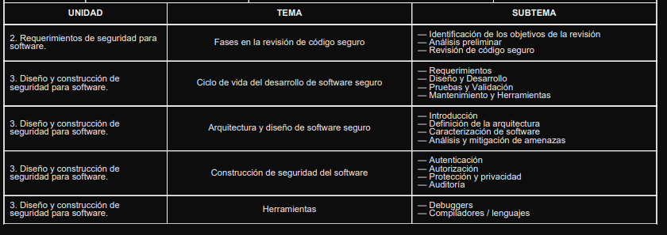

GUÍA DE PRÁCTICA

RESULTADOS DE APRENDIZAJE
Conocer y comprender los requerimientos de seguridad para software.
Conocer y aplicar las buenas prácticas del diseño y construcción de software.

OBJETIVOS DE LA PRÁCTICA
1.- RECONOCER LOS CONCEPTOS FUNDAMENTALES DE LA SEGURIDAD DE SOFTWARE, SU ESTRUCTURA INTERNA, LOS DIFERENTES TIPOS Y
SUS OPERACIONES ESENCIALES, MEDIANTE EL USO DE RECURSOS WEB INTERACTIVOS Y ACTIVIDADES PRÁCTICAS EN LÍNEA QUE
PERMITAN AL ESTUDIANTE DESARROLLAR UNA COMPRENSIÓN APLICADA DEL ROL.

1.1. REQUERIMIENTOS
Incorporando la seguridad desde la fase de requerimientos
Recurso web: https://mtechnology.pro/blog/seguridad-en-el-desarrollo-de-software-estrategias-y-consejos
Objetivo: Reconocer la importancia de incluir requisitos de seguridad desde el inicio del desarrollo.
Instrucciones:
Lee la sección sobre requerimientos del SDLC seguro de OWASP.
Menciona 3 tipos de requisitos funcionales relacionados con seguridad.
Redacta un ejemplo de historia de usuario que incluya un aspecto de seguridad.

1.2. DISEÑO Y DESARROLLO
Aplicando principios de diseño seguro en el ciclo de vida
Recurso web: https://binmile.com/blog/secure-design-principles/
Objetivo: Conocer los principios básicos de diseño seguro de software.
Instrucciones:
Revisa los principios de diseño seguro en el recurso.
Elige 2 y explica cómo se aplicarían en el diseño de una aplicación de e-commerce.
Realiza un diagrama simple en draw.io sobre su implementación.

1.3. PRUEBAS Y VALIDACIÓN
Verificando que el software cumpla requisitos de seguridad
Recurso web: https://owasp.org/www-project-web-security-testing-guide/
Objetivo: Explorar técnicas y herramientas para probar la seguridad del software.
Instrucciones:
Lee el OWASP Web Security Testing Guide.
Enumera 3 tipos de pruebas de seguridad recomendadas.
Simula una prueba manual con una app de ejemplo y documenta tus hallazgos.

1.4. MANTENIMIENTO Y HERRAMIENTAS
Mantenimiento seguro y uso de herramientas de actualización de código
Recurso web: https://www.automox.com/blog/vulnerability-definition-use-after-free
Objetivo: Comprender cómo mantener la seguridad tras la liberación del software.
Instrucciones:
Estudia las prácticas de gestión de parches.
Describe un caso en que un fallo de mantenimiento causó una vulnerabilidad.
Redacta una guía de 5 pasos para mantener seguro un software ya publicado.

2.1. INTRODUCCIÓN
Conceptos fundamentales de arquitectura segura
Recurso web: https://www.inesdi.com/blog/arquitectura-de-software-5-patrones-principales/
Objetivo: Conocer los conceptos clave en arquitectura de software seguro.
Instrucciones:
Lee el documento sobre arquitectura segura.
Resume qué es una arquitectura segura y sus beneficios.
Realiza un mapa mental con los conceptos clave.

2.2. DEFINICIÓN DE LA ARQUITECTURA
Proceso de estructurar el software pensando en la seguridad
Recurso web: https://martinfowler.com/architecture/
Objetivo: Entender cómo se define una arquitectura de software segura.
Instrucciones:
Revisa el artículo de Martin Fowler sobre arquitectura.
Elabora un ejemplo de arquitectura multicapa explicando qué capas pueden integrar seguridad.
Dibuja un esquema visual en www.draw.io.

2.3. CARACTERIZACIÓN DE SOFTWARE
Componentes y atributos de seguridad en una solución de software
Recurso web:
https://es.linkedin.com/pulse/fortaleciendo-el-desarrollo-de-software-con-un-s-sdlc-alvaro-elltf#:~:text=2.,esos%20riesgos%20desde%20el%20dise%C3%B1o.
Objetivo: Analizar cómo caracterizar el software considerando su seguridad.
Instrucciones:
Investiga qué atributos hacen a un software más seguro.
Describe una app que uses con frecuencia y sus características de seguridad.
Compara su diseño con uno inseguro y explica diferencias.

2.4. ANÁLISIS Y MITIGACIÓN DE AMENAZAS
Técnicas para identificar y reducir amenazas desde el diseño
Recurso web: https://owasp.org/www-community/Threat_Modeling
Objetivo: Aplicar técnicas básicas de modelado de amenazas.
Instrucciones:
Aprende sobre STRIDE y DREAD como métodos de análisis.
Elabora un modelo de amenazas simple usando STRIDE para una app bancaria.
Sugiere 3 contramedidas para mitigar los riesgos identificados

3.1. AUTENTICACIÓN
Mecanismos seguros de identificación de usuarios
Recurso web: https://www.microsoft.com/es-ar/security/business/security-101/what-is-authentication
Objetivo: Comprender los diferentes métodos de autenticación.
Instrucciones:
Revisa los tipos de autenticación (password, MFA, biométrica).
Elabora un cuadro comparativo de 3 métodos.
Explica qué riesgos puede tener una autenticación mal implementada.

3.2. AUTORIZACIÓN
Controlando el acceso a recursos de forma segura
Recurso web:
https://www.ibm.com/es-es/think/topics/authentication-vs-authorization#:~:text=La%20autenticaci%C3%B3n%20verifica%20la%20identidad,a%20los%20recursos%20del%20Objetivo: Distinguir entre autenticación y autorización.
Instrucciones:
Lee sobre control de acceso basado en roles (RBAC).
Crea una tabla de roles para una app de gestión escolar.
Especifica qué acciones puede realizar cada rol.

3.3. PROTECCIÓN Y PRIVACIDAD
Salvaguardando los datos sensibles en el software
Recurso web:
https://www.cesuma.mx/blog/que-es-la-proteccion-de-los-datos-personales.html#:~:text=La%20protecci%C3%B3n%20de%20datos%20personales%20es%20importante%20Objetivo: Comprender la importancia de la protección de datos personales.
Instrucciones:
Lee sobre privacidad de datos.
Redacta qué datos personales recoge una app popular (como WhatsApp).
Sugiere dos mecanismos para proteger dicha información.

3.4. AUDITORÍA
Implementando mecanismos para rastrear el uso del sistema
Recurso web: https://venu-iq.com/the-essential-guide-to-conducting-an-event-audit/
Objetivo: Conocer cómo registrar eventos importantes para fines de auditoría.
Instrucciones:
Revisa qué eventos deben auditarse (logins, cambios de config., etc.).
Diseña una estructura simple de logs para una aplicación web.
Comenta cómo los logs pueden ayudar a identificar incidentes.

4.1. DEBUGGERS
Herramientas de depuración como aliadas para asegurar el código
Recurso web: https://developer.mozilla.org/en-US/docs/Tools/Debugger
Objetivo: Explorar el uso de depuradores para identificar errores de seguridad.
Instrucciones:
Revisa cómo usar el depurador del navegador Firefox.
Abre una web vulnerable de prueba (como WebGoat) y depura su JavaScript.
Documenta los hallazgos e interpreta su riesgo.

4.2. COMPILADORES / LENGUAJES
Cómo los lenguajes y compiladores pueden contribuir a la seguridad
Recurso web:
https://www.legitsecurity.com/aspm-knowledge-base/best-programming-language-for-cyber-security#:~:text=Ning%C3%BAn%20lenguaje%20lo%20abarca%20todo,de%20usObjetivo: Analizar cómo la elección del lenguaje afecta la seguridad del software.
Instrucciones:
Lee la guía para elegir lenguajes seguros.
Realiza una tabla comparando Java, C y Python en términos de seguridad.
Indica cuál usarías para una app bancaria y por qué.
